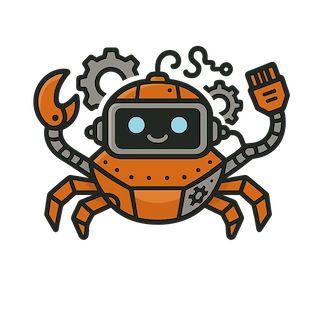

[](https://github.com/aleury/rmachine/actions/workflows/ci.yaml)
[](https://github.com/aleury/rmachine/actions/workflows/nightly.yaml)
[](https://github.com/aleury/rmachine/actions/workflows/audit.yaml)


# R-Machine: RISC-V Emulator




A RISC-V RV32I emulator and assembler written in Rust.

## Overview

R-Machine is an educational project that implements a subset of the RISC-V RV32I (32-bit integer) instruction set architecture. It includes:

- A 32-bit RISC-V CPU emulator with 18 registers (subset of RV32I's 32 registers)
- An assembler that converts assembly code to machine code
- A debugger for step-by-step execution
- Support for 9 RISC-V instructions (with more planned)

## Features

- **Simple Architecture**: 18 32-bit registers with clear purposes
- **Rich Instruction Set**: 9 instructions covering arithmetic, logic, branching, and memory operations
- **Development Tools**: Includes assembler (`rasm`), debugger (`rmon`), and disassembler (`rdis`)
- **Educational Focus**: Clean, understandable implementation ideal for learning about CPU design and RISC-V architecture

## Installation

```bash
cargo install rmachine
```

Or build from source:

```bash
git clone https://github.com/aleury/rmachine
cd rmachine
cargo build --release
```

## Usage

### Assembler (rasm)

Assemble source code into executable format:

```bash
rasm input.s              # Creates input (executable without extension)
rasm input.s -o output    # Specify custom output file
```

### Debugger (rmon)

Run programs with debugging support:

```bash
rmon program.rmx       # Run with debugger
rmon program.rmx -d    # Start in debug mode
```

### Disassembler (rdis)

Disassemble executable files:

```bash
rdis program.rmx
```

## Examples

The `examples/` directory contains sample R-Machine assembly programs:

- `ex1.s` - Hello World program demonstrating system calls

Run an example:

```bash
rasm examples/ex1.s -o hello.rmx
rmon hello.rmx
```

## License

This project is dual-licensed under MIT OR Apache-2.0.
